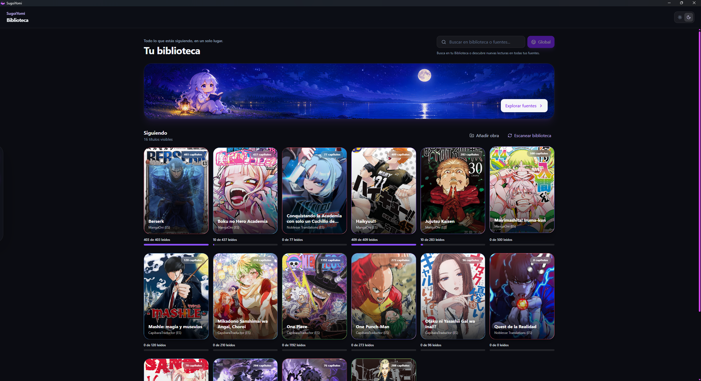
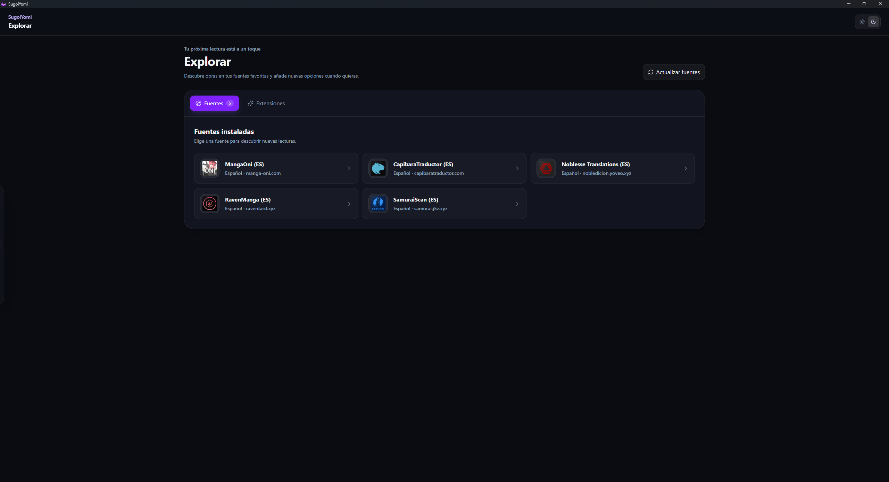
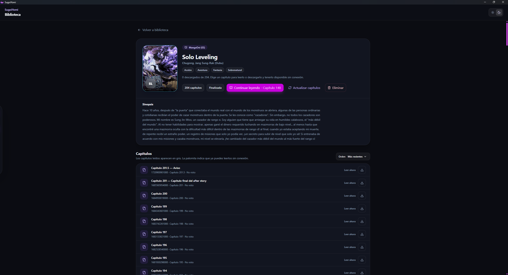
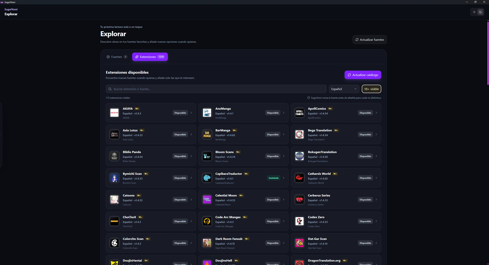
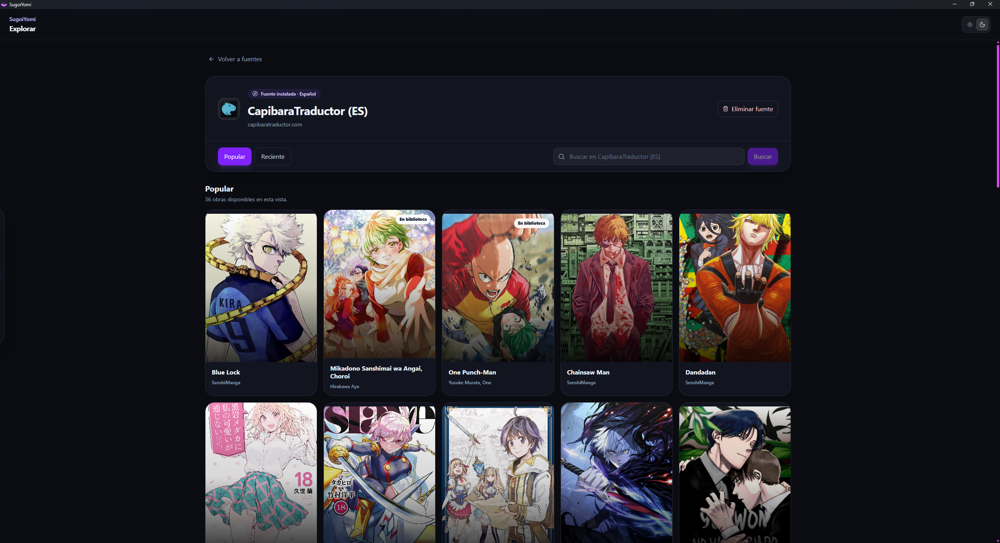
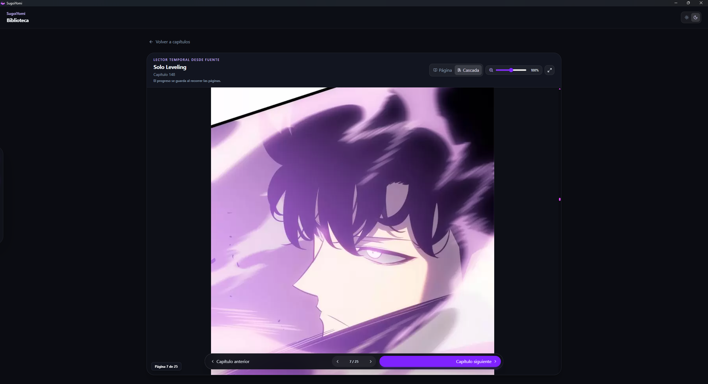

<div align="center">
  

  # SugoiYomi

  ### Tu rincón de lectura para manga local, remoto y offline-first en Windows

  <p>
    <a href="https://github.com/Mr-Prince404/SugoiYomi-Releases/releases/latest"><strong>⬇️ Descargar la última versión</strong></a>
    ·
    <a href="#capturas">Ver capturas</a>
    ·
    <a href="#apoyar-el-proyecto">Apoyar el proyecto</a>
    ·
    <a href="#reportar-un-problema">Reportar un problema</a>
  </p>

  
  
  
</div>

---

## 🌙 ¿Qué es SugoiYomi?

**SugoiYomi** es un proyecto personal creado para disfrutar manga en Windows con una experiencia moderna, cómoda y centrada en tu biblioteca.

Puedes instalar fuentes, explorar obras, leer en modo página o cascada, guardar tu progreso, descargar capítulos `.cbz` y seguir leyendo sin conexión cuando ya tienes el contenido guardado.

Este proyecto seguirá creciendo poco a poco: iré publicando actualizaciones enfocadas en estabilidad, optimización, experiencia de lectura y nuevas mejoras que realmente valgan la pena. ✨

---

## ✨ Lo que puedes hacer

- 📚 Organizar una biblioteca local y remota en un solo lugar.
- 🔎 Instalar fuentes y buscar obras desde Explorar.
- 📖 Leer en modo **Página** o **Cascada**.
- 🧭 Reanudar desde el capítulo y página donde te quedaste.
- 💾 Descargar capítulos en `.cbz` para lectura offline.
- 🗂️ Consultar historial, progreso y capítulos vistos.
- 🔄 Actualizar fuentes, capítulos y portadas cuando estén disponibles.
- 🛟 Exportar, importar o restaurar los datos de la aplicación.

---

## Capturas

<table>
  <tr>
    <td align="center"><strong>Biblioteca</strong></td>
    <td align="center"><strong>Explorar</strong></td>
  </tr>
  <tr>
    <td></td>
    <td></td>
  </tr>
  <tr>
    <td align="center"><strong>Ficha de obra</strong></td>
    <td align="center"><strong>Fuentes instalables</strong></td>
  </tr>
  <tr>
    <td></td>
    <td></td>
  </tr>
  <tr>
    <td align="center"><strong>Catálogo</strong></td>
    <td align="center"><strong>Lector</strong></td>
  </tr>
  <tr>
    <td></td>
    <td></td>
  </tr>
</table>

---

## ⬇️ Instalación

1. Entra a la sección de [Releases](https://github.com/Mr-Prince404/SugoiYomi-Releases/releases/latest).
2. Descarga el archivo recomendado:

   ```text
   SugoiYomi_1.0.1_x64-setup.exe
   ```

3. Ejecuta el instalador.
4. Abre SugoiYomi, instala una fuente desde **Explorar** y empieza tu biblioteca.

> SugoiYomi está pensado para Windows 10 y Windows 11 de 64 bits.

---

## 🧩 Tecnologías del proyecto

| Área | Tecnologías |
|---|---|
| Aplicación de escritorio | Tauri v2 |
| Interfaz | React + TypeScript |
| Empaquetado frontend | Vite |
| Estilos | Tailwind CSS |
| Lógica local | Rust |
| Datos y progreso | SQLite / rusqlite |
| Motor de fuentes | Core local basado en Suwayomi |
| Comunicación interna | GraphQL local |
| Runtime | Eclipse Temurin JRE 21 |
| Descargas offline | CBZ / ZIP |
| Instalador | NSIS / MSI |

---

## 🗺️ Próximas actualizaciones

El proyecto está vivo y seguirá afinándose. Algunas líneas de trabajo previstas son:

- Mejoras de rendimiento y consumo de recursos.
- Pulido adicional del lector y navegación.
- Opciones de personalización.
- Mejoras de accesibilidad.
- Herramientas de organización para la biblioteca.
- Correcciones reportadas por la comunidad.

---

## Apoyar el proyecto

SugoiYomi es un proyecto personal. Si te gusta, te resulta útil y quieres apoyar su desarrollo, una donación ayuda a cubrir tiempo, pruebas y futuras mejoras.

<div align="center">
  <a href="https://ko-fi.com/mrprince404">
    
  </a>
</div>

---

## Reportar un problema

¿Encontraste un error, una fuente que dejó de funcionar o una mejora que te gustaría ver?

Abre un **Issue** en este repositorio e incluye, cuando puedas:

- Versión de SugoiYomi.
- Qué estabas intentando hacer.
- Qué esperabas que ocurriera.
- Qué ocurrió realmente.
- Captura o registro, si aplica.

---

## ⚠️ Aviso importante

SugoiYomi no distribuye contenido propio. Las fuentes y catálogos dependen de servicios externos, por lo que su disponibilidad puede cambiar con el tiempo.

Cada persona es responsable del uso que dé a las fuentes instaladas y al contenido al que acceda mediante ellas.

---

## 👨‍💻 Autor

Desarrollado por **Mr-Prince404**.

Hecho con curiosidad, muchas pruebas y una obsesión bastante sana por una experiencia de lectura bonita. 🌙

---

<div align="center">
  <sub>Gracias por probar SugoiYomi y acompañar su crecimiento.</sub>
</div>
