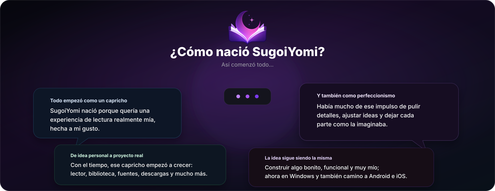

<div align="center">

  

  <br />

  <p>

    <a href="https://github.com/Mr-Prince404/SugoiYomi-Releases/releases/latest"><strong>⬇️ Descargar SugoiYomi para Windows</strong></a>

    ·

    <a href="#desktop-20">Desktop 2.0</a>

    ·

    <a href="#capturas">Ver capturas</a>

    ·

    <a href="#-sugoiyomi-mobile">SugoiYomi Mobile</a>

    ·

    <a href="#apoyar-el-proyecto">Apoyar el proyecto</a>

    ·

    <a href="https://github.com/Mr-Prince404/SugoiYomi-Releases/issues/new/choose">Reportar un problema</a>

  </p>

  

  

  

  

  

</div>

---

## 🌙 ¿Qué es SugoiYomi?

**SugoiYomi** es un proyecto personal creado para ofrecer una experiencia de lectura de manga moderna, cómoda y centrada en tu biblioteca.

Actualmente puedes disfrutar de **SugoiYomi Desktop 2.0 para Windows**, con biblioteca, fuentes instalables, lectura online y offline, descargas, historial, progreso y diferentes modos de lectura.

Pero SugoiYomi ya no termina en el escritorio.

**SugoiYomi Mobile se encuentra actualmente en desarrollo para Android e iOS**, con ambas plataformas avanzando en paralelo hacia su primera versión pública.

La experiencia móvil está siendo construida desde una arquitectura compartida, manteniendo las características principales de SugoiYomi mientras cada plataforma recibe las adaptaciones necesarias para ofrecer una experiencia natural dentro de Android e iOS.

El objetivo es que **SugoiYomi Mobile debute simultáneamente en Android e iOS**, ofreciendo desde su primer lanzamiento la misma base de biblioteca, lectura, fuentes, descargas, historial y experiencia offline en ambas plataformas.

La idea sigue siendo la misma desde el principio:

> **Tu biblioteca. Tus fuentes. Tu progreso. Tu forma de leer.**

Este proyecto seguirá creciendo poco a poco, con actualizaciones enfocadas en rendimiento, estabilidad, experiencia de lectura y mejoras que realmente aporten valor. ✨

---

## 💬 Y bueno...

<div align="center">



<br />

<sub>Esa es un poco de la historia del comienzo</sub>

</div>

---

## ✨ Lo que puedes hacer

* 📚 Organizar una biblioteca local y remota en un solo lugar.

* 🔎 Instalar fuentes y explorar obras desde diferentes catálogos.

* 📖 Leer en modo **Página** o **Cascada**.

* 🧭 Reanudar exactamente desde donde dejaste tu lectura.

* 💾 Descargar capítulos en `.cbz` para disfrutarlos sin conexión.

* 🗂️ Consultar historial, progreso y capítulos vistos.

* 🔄 Actualizar fuentes, capítulos y portadas cuando estén disponibles.

* 🛟 Exportar, importar o restaurar los datos de la aplicación.

---

<a id="desktop-20"></a>

## ✨ SugoiYomi Desktop 2.0 — Disponible

<div align="center">


<br />

<sub>SugoiYomi Desktop 2.0 ya está disponible para Windows.</sub>

</div>

**SugoiYomi Desktop 2.0 ya está disponible.** Esta versión supone una renovación visual y funcional de la experiencia de escritorio, manteniendo la idea central del proyecto: leer, organizar y descubrir contenido de una forma cómoda y directa.

La versión **2.0.0** ya puede descargarse públicamente y reúne una renovación importante de la biblioteca, el lector, las fuentes, las extensiones, las actualizaciones y el historial, junto con numerosos ajustes de **estabilidad, rendimiento y consistencia**.

El desarrollo continúa y SugoiYomi Desktop seguirá recibiendo correcciones, mejoras de rendimiento y nuevos refinamientos después de esta versión.

<div align="center">

**Disponible ahora para Windows 10 y Windows 11.**

<sub>La interfaz seguirá evolucionando y algunos elementos pueden cambiar en futuras actualizaciones.</sub>

</div>

---


## Capturas

<div align="center">


<br />

<sub>Pantallas principales de SugoiYomi Desktop.</sub>

</div>

---

## ⬇️ Instalación

### 🖥️ Windows

La versión pública actual, **SugoiYomi Desktop 2.0.0**, está disponible para **Windows 10 y Windows 11 de 64 bits**.

1. Entra a la sección de [Releases](https://github.com/Mr-Prince404/SugoiYomi-Releases/releases/latest).

2. Descarga el instalador recomendado:

   ```text

   SugoiYomi_2.0.0_x64-setup.exe

   ```

3. Ejecuta el instalador.

4. Abre SugoiYomi.

5. Instala una fuente desde **Explorar** y empieza a construir tu biblioteca.

---

## 📱 SugoiYomi Mobile

<div align="center">

### La biblioteca está a punto de salir del escritorio.

</div>

**SugoiYomi Mobile ya se encuentra oficialmente en desarrollo para Android e iOS.**

Ambas plataformas están siendo desarrolladas en paralelo como parte de una misma aplicación móvil, compartiendo arquitectura, comportamiento y funcionalidades siempre que sea posible, pero respetando al mismo tiempo las características y convenciones propias de cada sistema.

La versión móvil no busca ser simplemente una adaptación de la interfaz de escritorio. Está siendo desarrollada como una experiencia pensada específicamente para dispositivos móviles, conservando las ideas principales de SugoiYomi mientras se adaptan la navegación, el lector, las descargas y la gestión de biblioteca al uso táctil.

Entre los pilares de SugoiYomi Mobile se encuentran:

* 📚 Biblioteca optimizada para colecciones grandes.

* 🔎 Exploración y búsqueda mediante fuentes.

* 📖 Lector de página y lectura continua.

* 🤏 Zoom, gestos táctiles y navegación diseñada para móvil.

* 💾 Descargas y lectura offline.

* 🧭 Historial y reanudación de lectura.

* ⚡ Especial atención al rendimiento y consumo de memoria.

* 📱 Experiencia adaptada individualmente a Android y iOS.

### Vista previa móvil

<div align="center">

<sub>Primer vistazo visual de SugoiYomi Mobile en Android e iOS.</sub>

<br />

<br />


<br />

<br />

<sub>Android e iOS están siendo desarrollados en paralelo como parte de una misma experiencia móvil.</sub>

</div>

### Android & iOS — En desarrollo

**SugoiYomi Mobile está siendo desarrollado simultáneamente para Android e iOS.**

La aplicación comparte una misma base tecnológica y una arquitectura común entre ambas plataformas, permitiendo que sus principales funciones evolucionen de forma conjunta.

Biblioteca, lector, sistema de fuentes, descargas, historial, navegación, almacenamiento y rendimiento forman parte de un mismo proceso de desarrollo móvil, con las adaptaciones necesarias para que cada plataforma conserve una experiencia coherente con su ecosistema.

La primera versión pública será publicada simultáneamente para ambas plataformas cuando SugoiYomi Mobile alcance el nivel de estabilidad, rendimiento y calidad previsto para su lanzamiento.

<div align="center">

### Windows ✅    Android    iOS

**Próximo lanzamiento: SugoiYomi Mobile para Android & iOS**

</div>

---

## 🧩 Tecnologías del proyecto

### SugoiYomi Desktop

| Área                     | Tecnologías            |

| ------------------------ | ---------------------- |

| Aplicación de escritorio | Tauri v2               |

| Interfaz                 | React + TypeScript     |

| Empaquetado frontend     | Vite                   |

| Estilos                  | Tailwind CSS           |

| Lógica local             | Rust                   |

| Datos y progreso         | SQLite / rusqlite      |

| Motor de fuentes         | Core local             |

| Comunicación interna     | GraphQL local          |

| Runtime                  | Eclipse Temurin JRE 21 |

| Descargas offline        | CBZ / ZIP              |

| Instalador               | NSIS / MSI             |

### SugoiYomi Mobile

| Área               | Tecnologías                             |

| ------------------ | --------------------------------------- |

| Plataformas        | Android / iOS                           |

| Framework          | React Native + Expo                     |

| Lenguaje           | TypeScript                              |

| Navegación         | Expo Router                             |

| Persistencia       | SQLite                                  |

| Runtime JavaScript | Hermes                                  |

| Arquitectura       | React Native New Architecture           |

| Lectura offline    | CBZ / ZIP                               |

| Fuentes remotas    | Runtime y motor de fuentes de SugoiYomi |

---

## 🗺️ El camino de SugoiYomi

SugoiYomi continúa evolucionando tanto en escritorio como en móvil.

### 🖥️ Windows

* Mejoras continuas de rendimiento y consumo de recursos.

* Pulido adicional del lector y navegación.

* Más opciones de personalización.

* Mejoras de accesibilidad.

* Nuevas herramientas de organización.

* Correcciones reportadas por la comunidad.

### 📱 Mobile

* Desarrollo simultáneo de **SugoiYomi Mobile para Android e iOS**.

* Optimización de rendimiento, memoria y tiempos de carga.

* Pulido del lector táctil.

* Descargas y experiencia offline.

* Integración y estabilización del sistema de fuentes.

* Adaptación de interfaz y comportamiento a las particularidades de Android e iOS.

* Validación funcional y de rendimiento en ambas plataformas.

* Lanzamiento simultáneo de **SugoiYomi Mobile para Android e iOS**.

El objetivo no es lanzar por lanzar.

La primera versión de SugoiYomi Mobile estará disponible en **Android e iOS al mismo tiempo**, cuando ambas plataformas tengan la estabilidad, rendimiento y calidad que quiero para SugoiYomi.

---

## 💜 Apoyar el proyecto

SugoiYomi es un proyecto personal desarrollado y mantenido de manera independiente.

Si te gusta, te resulta útil o simplemente quieres ayudar a que continúe creciendo, una donación ayuda a cubrir tiempo de desarrollo, infraestructura, dispositivos de prueba y futuras mejoras.

<div align="center">

  <a href="https://ko-fi.com/mrprince404">

    

  </a>

</div>

Cada apoyo, reporte, sugerencia o persona que prueba SugoiYomi también ayuda al proyecto a seguir adelante. 💜

---

## Reportar un problema

¿Encontraste un error, una fuente que dejó de funcionar o tienes una idea para mejorar SugoiYomi?

Elige el tipo de reporte que quieras crear:

[** Reportar un error o proponer una mejora**](https://github.com/Mr-Prince404/SugoiYomi-Releases/issues/new/choose)

Los formularios te guiarán para incluir la información necesaria.

---

## ⚠️ Aviso importante

SugoiYomi no distribuye ni aloja contenido propio.

Las fuentes, catálogos y servicios externos utilizados mediante la aplicación son independientes de SugoiYomi y su disponibilidad puede cambiar con el tiempo.

Cada persona es responsable del uso que dé a las fuentes instaladas y al contenido al que acceda mediante ellas.

---

## Autor

Desarrollado por **Mr-Prince404**.

Hecho con curiosidad, capricho, incontables pruebas, algunas madrugadas cuestionables y una obsesión por construir una experiencia de lectura bonita.

---

<div align="center">

### 🌙 SugoiYomi

**Read your way. Anywhere.**

<sub>Gracias por probar SugoiYomi y acompañar su crecimiento.</sub>

<br />

<sub>Windows · Android · iOS</sub>

</div>